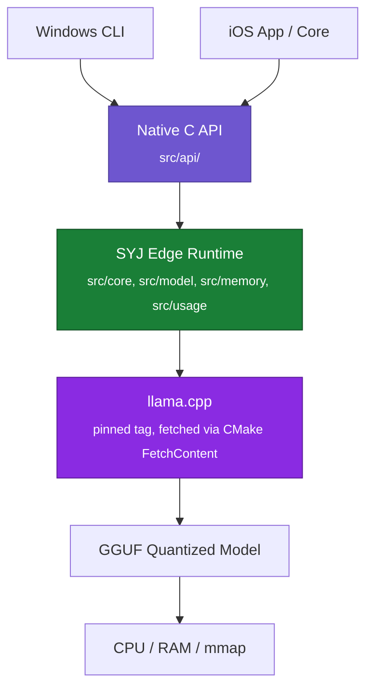
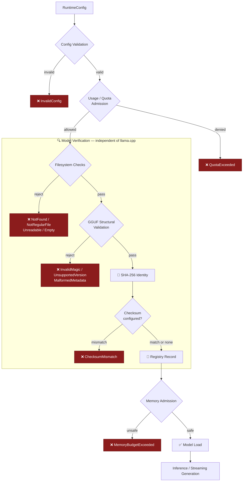

<div align="center">

# 🧠 SYJ EdgeMind

### Private, Offline AI for Low-Memory Devices

[](https://en.cppreference.com/w/cpp/17)
[](https://github.com/ggml-org/llama.cpp)
[-blue?style=flat-square)](LICENSE)
[](docs/supported-platforms.md)
[](docs/security.md)
[](ROADMAP.md)


*One inference core. One native C API. Zero hidden networking.*

</div>

---

> **Honesty first, always.** Every status claim below distinguishes **real-hardware-confirmed** from **sandbox-validated, hardware-pending** from **not yet started**. See [Build & validation status](#build--validation-status) for the exact, current line between them — nothing here is rounded up to look better than it is.

## Table of Contents

- [Why it exists](#why-it-exists)
- [Roadmap at a glance](#roadmap-at-a-glance)
- [Features](#features)
- [Architecture](#architecture)
- [Model verification pipeline (Phase 3)](#model-verification-pipeline-phase-3)
- [Supported hardware](#supported-hardware)
- [Installation](#installation)
- [Usage](#usage)
- [CLI commands](#cli-commands)
- [Model management & verification](#model-management--verification)
- [Memory management](#memory-management)
- [Usage / quota management](#usage--quota-management-v030)
- [Build & validation status](#build--validation-status)
- [Troubleshooting](#troubleshooting)
- [Security](#security)
- [Privacy](#privacy)
- [Development](#development)
- [Contributing](#contributing)
- [License](#license)

## Why it exists

Most local-AI tooling assumes generous RAM, a GPU, or a heavyweight runtime (Python/Node/Electron). SYJ EdgeMind targets the opposite: **CPU-only machines with roughly 4 GB of system RAM**, where every megabyte allocated to the runtime is a megabyte not available to the model.

## 🗺️ Roadmap at a glance

```mermaid
flowchart LR
    P0["Phase 0<br/>Bootstrap"]:::confirmed --> P1["Phase 1<br/>llama.cpp Runtime"]:::confirmed
    P1 --> P2["Phase 2<br/>Memory Safety"]:::implemented
    P2 --> PQ["v0.3.0<br/>Usage / Quota"]:::implemented
    PQ --> P3["Phase 3<br/>Model Registry<br/>and Verification"]:::implemented
    P3 --> P4["Phase 4<br/>Production CLI"]:::planned
    P4 --> P5["Phase 5<br/>Windows Packaging"]:::planned
    P5 --> P6["Phase 6<br/>iOS Bridge"]:::planned
    P6 --> P7["Phase 7<br/>iOS UI"]:::planned
    P7 --> P8["Phase 8<br/>Performance"]:::planned
    P8 --> P9["Phase 9<br/>Hardening"]:::planned
    P9 --> P10["Phase 10<br/>Release Candidate"]:::planned
    P10 --> P11["Phase 11<br/>v0.1.0"]:::planned

    classDef confirmed fill:#2ea44f,stroke:#1a7f37,color:#fff
    classDef implemented fill:#d29922,stroke:#9a6700,color:#fff
    classDef planned fill:#30363d,stroke:#6e7681,color:#c9d1d9
```



🟢 **Confirmed on real hardware** &nbsp;•&nbsp; 🟠 **Implemented, sandbox-validated, real-hardware validation pending** &nbsp;•&nbsp; ⚪ **Not started**

Full detail, exact test counts, and per-phase acceptance criteria: [ROADMAP.md](ROADMAP.md).

## Features

| | |
|---|---|
| 🖥️ **CPU-only inference** | via [llama.cpp](https://github.com/ggml-org/llama.cpp), pinned to a specific tag — never tracking `main` (see [docs/architecture.md](docs/architecture.md)) |
| 🗺️ **Memory-mapped GGUF loading** | no custom mmap layer — relies on llama.cpp's own upstream default |
| 🛡️ **Memory safety engine** | estimates model + KV-cache + overhead *before* committing to a context, fails closed on invalid/unavailable hyperparameters |
| 🔍 **Model verification** | GGUF structural validation and SHA-256 identity, built independently of llama.cpp, *before* any file reaches inference |
| 📇 **Local model registry** | deterministic, content-hash-keyed, persisted locally — no cloud, no catalogue |
| ⏱️ **Usage / quota guard** | optional, entirely local session-time / message / token limits, fail-closed on corrupted state |
| 🔌 **Offline after acquisition** | no telemetry, no analytics, no hidden networking, no API keys — ever |
| 🧩 **One inference core** | a single native C API shared by every platform wrapper — no duplicated inference logic per platform |

## 🏗️ Architecture



There is exactly **one** inference core. Platform layers (`platform/windows`, `platform/ios`) are thin wrappers over `src/api/edge_mind_api.h` and must never contain their own inference logic. Full component breakdown: [docs/architecture.md](docs/architecture.md).

## 🔐 Model verification pipeline (Phase 3)

Every model path — whether passed via `--model`, imported explicitly, or reloaded — goes through the same gate before it can ever reach `llama_model_load_from_file()`:



**GGUF structural validation is deliberately independent of llama.cpp** — it parses the public GGUF binary format directly, so a corrupted or adversarial file is rejected *before* llama.cpp's own parser ever sees it. Every declared length/count in the file is bounds-checked against a sane ceiling *and* the file's actual size before any read is attempted — an adversarial file claiming a multi-exabyte string is rejected in constant time, never attempted as an allocation. Full design, security properties, and known limitations: [docs/model-registry.md](docs/model-registry.md).

## Supported hardware

See [docs/supported-platforms.md](docs/supported-platforms.md).

## Installation

<details open>
<summary><strong>🐧 Build from source (all platforms)</strong></summary>

<br>

Requires CMake 3.20+, a C++17 compiler, and network access (to fetch the pinned llama.cpp source at configure time):

```bash
git clone https://github.com/SHalimoosavi/SYJ-EdgeMind.git
cd SYJ-EdgeMind
cmake -S . -B build
cmake --build build --config Release
ctest --test-dir build --output-on-failure
```

See [docs/development.md](docs/development.md) for what this actually does, and [Build & validation status](#build--validation-status) below for exactly what has and hasn't been verified where.

</details>

<details>
<summary><strong>🪟 Windows</strong></summary>

<br>

Packaged installer scripts are not available yet (see [ROADMAP.md](ROADMAP.md), Phase 5). The CMake build above works on Windows with MSVC, but there is no `.ps1`/`.bat` convenience script yet.

</details>

<details>
<summary><strong>🍎 iOS</strong></summary>

<br>

Not yet available (see [ROADMAP.md](ROADMAP.md), Phase 6–7).

</details>

## Usage

```bash
./build/syj-edgemind --model /path/to/model.gguf --context 1024 --threads 4 --max-tokens 256
```

Omit a trailing prompt to start interactive mode instead of a single-shot response. Run `--help` for the full option list, including the memory-budget, usage-quota, and model-verification flags (`--memory-budget`, `--safety-reserve`, `--time-limit-minutes`, `--message-limit`, `--token-limit`, `--checksum`, `--registry-path`, ...).

## CLI commands

Interactive mode supports:

| Command | Shows |
|---|---|
| `/help` | interactive command list |
| `/info` | loaded model info (params, size, context, threads) — from **llama.cpp**, after load |
| `/verify` | model-verification report — from **SYJ EdgeMind's own GGUF reader**, independent of llama.cpp |
| `/memory` | memory-budget diagnostic from the last load |
| `/usage` | current usage, remaining quota, and reset time |
| `/reset` | clear the context and start fresh |
| `/quit` | exit |

`/context` (richer context diagnostics) is planned for Phase 4.

## Model management & verification

Point `--model` at a local GGUF file — SYJ EdgeMind verifies its structure, computes a deterministic SHA-256 identity, optionally checks it against `--checksum`, and records it in a local registry (`--registry-path`, default `.syj_edgemind_model_registry`) before it is ever loaded into inference. An invalid, corrupted, or checksum-mismatched file never reaches `llama.cpp`. There is no model downloader or catalogue — import is local-file-only by design; see [docs/model-registry.md](docs/model-registry.md) for why, and for the full pipeline, data model, and duplicate-import behavior.

## Memory management

SYJ EdgeMind estimates model weight, KV-cache, and compute-buffer memory before committing to a context, and refuses to create one if the total would exceed your configured budget (default 3000 MB budget / 300 MB safety reserve — tune with `--memory-budget`/`--safety-reserve`). The estimation is **fail-closed**: if a model's hyperparameters can't be established safely (invalid, out of a sane range, or would overflow), the configuration is rejected outright rather than silently treated as zero-cost. See [docs/memory-model.md](docs/memory-model.md) for the full pipeline, what's an actual measurement vs. an estimate, the exact (inclusive) boundary rule, and current limitations — notably, live system-RAM availability isn't factored into the decision yet, only the configured budget.

## Usage / quota management (v0.3.0)

An optional, entirely local and offline usage guard — **not** a licensing or subscription system, no cloud, no telemetry. Configure any combination of `--time-limit-minutes`, `--message-limit`, `--token-limit` (each defaults to unlimited); usage persists across restarts in a small versioned local file (`--usage-state-path`, default `.syj_edgemind_usage_state`) and resets on a configurable period (`--reset-period-hours`, default 24h). A corrupted state file fails closed — never treated as unlimited access, and diagnostically distinct from a legitimately exhausted quota. See [docs/usage-model.md](docs/usage-model.md).

## 📊 Build & validation status

<details open>
<summary><strong>Click to expand — exactly what's been verified, and where</strong></summary>

<br>

| Subsystem | Sandbox compile | Sandbox tests (real, run) | Real hardware |
|---|:---:|:---:|:---:|
| Core runtime (Phase 1) | ✅ | — | 🟢 **Confirmed** — Android/Termux, `SmolLM2-135M-Instruct-Q4_K_M.gguf`, tag `v0.1.1` |
| Memory safety engine (Phase 2) | ✅ | ✅ pure/policy modules | 🟠 Pending |
| Usage / quota manager (v0.3.0) | ✅ | ✅ 8/8 | 🟠 Pending |
| Model registry & verification (Phase 3) | ✅ | ✅ 4/4 new binaries (see below) | 🟠 Pending |

**Phase 3 test detail** — all built and run for real in this project's development sandbox:

- `test_gguf_reader` — 12 real, byte-correct GGUF fixtures (valid v2/v3, invalid magic, truncated header/metadata, empty, two adversarial "absurd declared length" cases, unknown type code, missing-key handling, nonexistent path)
- `test_model_hash` — real NIST/FIPS 180-4 SHA-256 known-answer vectors, cross-checked against system `sha256sum`
- `test_model_verifier` — filesystem checks, checksum match/mismatch/case-insensitivity, directory rejection
- `test_model_registry` — persistence round-trip, corruption detection, import/dedup, lookup

SYJ EdgeMind's llama.cpp-*independent* source (config validation, context accounting, the memory estimator/budget policy, the usage/quota subsystem, and the entire Phase 3 model-verification module) has been compiled *and its tests actually run* in the sandbox used to build this project. The parts that depend on llama.cpp (tokenizer, sampler, inference engine, memory observer, C API, CLI, `Runtime`'s integration of all of the above) were verified for syntax/API-usage correctness against the real, current llama.cpp API but could not be *linked and run* in that sandbox — it has no network access to fetch llama.cpp's source, so `cmake -S . -B build` fails at the `FetchContent` step there, not due to an error in this project's code. On a machine with normal internet access, the build commands above fetch llama.cpp automatically.

**No sandbox in this project's history has been able to run a real `cmake`/`ctest`/Android-Termux pass for the Phase 2, v0.3.0, or Phase 3 code** — only Phase 1 has that real-hardware confirmation so far. See [docs/development.md](docs/development.md) and [docs/model-registry.md](docs/model-registry.md)'s "Validation status" section for the exact line, and please report back once you've run it on real hardware — that's the one thing no sandbox has been able to do.

</details>

## Troubleshooting

See [docs/troubleshooting.md](docs/troubleshooting.md).

## Security

See [SECURITY.md](SECURITY.md) and [docs/security.md](docs/security.md). No telemetry, no hidden networking, no cloud fallback, no secrets, no API keys. Model files are treated as untrusted input — see the [verification pipeline](#model-verification-pipeline-phase-3) above.

## Privacy

Models are downloaded/imported separately by the user, who is responsible for complying with the applicable model license. Inference itself requires zero network access.

## Development

See [docs/development.md](docs/development.md) and [CONTRIBUTING.md](CONTRIBUTING.md).

## Contributing

See [CONTRIBUTING.md](CONTRIBUTING.md).

## License

See [LICENSE](LICENSE). Third-party dependency licenses (llama.cpp, any bundled models) are tracked separately — see `docs/architecture.md` §Dependency Licensing. The project license will be finalized once that audit is complete.

---

<div align="center">

**[⬆ back to top](#syj-edgemind)**

Built for the machines everyone else's tooling forgot about.

</div>
